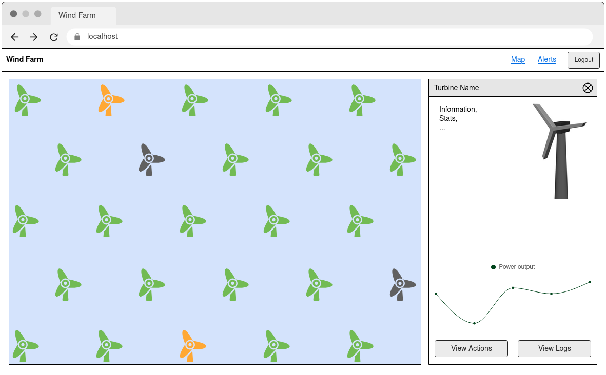

# Module D – Interactive Frontend using an API

You are asked to create a frontend for the REST API from module C.
Since the functionality you will create in this module builds on top of the functionality of module C, you will be given a working solution of module C.

You must build on the provided solution of module C instead of your own to ensure full feature parity.

## Competitor Information

- The frontend can be implemented using a framework and other available libraries.
- The application must be a Single Page Application (SPA).
- Page reloads must present the same content to the user as previously visible, except unsaved user-driven inputs.

## Assessment

Module D will be assessed using the provided version of Google Chrome. The assessment will include functional tests as well as user experience.

Any modifications in the provided backend of the previous module, including any changes to the database, will not be taken into account.

## Requirements

### 1. Authentication and Access Control

The website is publicly accessible for read-only usage, so no login is needed to access the website in general.

However, some actions and pages require an authenticated user.
Performing those actions must not be possible and links to those pages must not be visible for unauthenticated users.
Accessing a page that requires an authenticated user (such as the turbine logs page) must redirect unauthenticated users to the login page and, after a successful login, return them to the initially requested page.
Accessing a page that requires a specific role and the logged-in user does not have the necessary role must show an error page.

To log in, a button must be present on all pages to open a login form.
The login form authenticates the user with the provided credentials against the API and stores the returned token.
Refreshing the page must keep the login state.

If a user is logged in, they have a logout button on every page, which will clear the stored token and return the user to the read-only version.

The following users are provided to test authentication:

- user without role: `username: user`, `password: user12345`
- operator: `username: bob`, `password: bob12345`
- admin: `username: alice`, `password: alice12345`

### 2. Turbine Map Page

The turbine map page is the index page (default page when opening the web app) and is publicly accessible.

The central part of this page is a map showing the location of all turbines.
They are rendered in a rectangle where the turbine with the lowest latitude and lowest longitude is located in the bottom left corner, and the turbine with the highest latitude and highest longitude is located in the top right corner.
All turbines are fully visible and rendered in the correct relative location.
The map does not have to be an actual map and can, for example, just be a blue rectangle (indicating the sea) or a grid.

Each turbine has to be represented with an icon.
The icon color represents the status of the turbine, where `started` turbines are green, `maintenance` are orange, and `shutdown` are gray.

### 3. Turbine Detail Pane

Clicking on a turbine icon on the map shows the turbine detail pane, which is opened to the right of the page while still showing the turbine map in the left part of the page.

The turbine detail features the following information, if available:
- Name of the turbine
- Status (`started`, `maintenance`, `shutdown`)
- Latitude & longitude
- Yaw & Pitch
- Stats (Rotations per minute, power output in megawatts, temperature in °C)
- Freshness status of the turbine (`live`, `cached`, `missing`) and last update of the turbine

For status, yaw, pitch, RPM, power output, and temperature, the freshness status and last update of that field must be shown next to it.
A warning icon must be visible if a field has a missing status.

While having the detail pane open, the turbine data is refreshed in a 5-second interval, and the view is automatically updated.
For consistent display of information, the icon color on the map has to be updated as well.

The detail pane also features a simple power output graph, where the x-axis is the time and the y-axis is the power output (no labels required).
With each data refresh (every 5 seconds), a new data point gets added to the graph.
The graph data does not have to be persisted, meaning closing the detail pane and opening it again will start with an empty graph again.

Reloading the page while having the detail pane of a turbine open must also show the detail pane again.

### 4. 3D Turbine Model

The client found a script on the internet that renders a 3D turbine with a given yaw, pitch, and RPM.
This script must be integrated into the turbine detail pane to visualize the turbine stats.

The actual yaw, pitch, and RPM values of the turbine have to be passed to the script after the initial load of turbine data and with each subsequent refresh of data.

The README.md provided in the media files contains instructions on how to use the script.
The script must be loaded using best practices of the used framework (e.g. only loaded when used, not loaded multiple times).

### 5. Turbine Control

If the user is authenticated and has the role `operator` or `admin`, they can control the turbine within the turbine detail pane.

This includes:
- Modifying yaw (0 – 360) & pitch (-90 – 90) according to the allowed values of the API
- Transition the turbine to a different state according to the allowed transitions of the API

The frontend must already validate those actions (same requirements as for the API) and not send a request to the API in case of invalid values.

### 6. Alerts Page

The alerts page is only accessible for authenticated users with the role `operator` or `admin`.

List all active alerts with the following information:
- Timestamp in the format `dd.MM.yyyy HH:mm:ss`
- Alert type
- Turbine name
- Firing state
- Acknowledged state

There must also be a button for each alert to mark it as acknowledged, if it has not been acknowledged yet.
After acknowledging an alert, the status of that alert has to be updated in the list.

### 7. Actions Page

The actions page of a turbine is publicly accessible and can be opened from within the turbine detail pane.

It shows a list of all performed actions with the following information:
- Action type
- Pitch & yaw values in case the action type is `control`
- Timestamp in the format `dd.MM.yyyy HH:mm:ss`
- User who performed the action

### 8. Logs Page

The logs page is only accessible for authenticated users with the role `operator` or `admin` and can be opened from within the turbine detail pane.

It shows a list of all returned turbine logs with the following information:
- Timestamp in the format `dd.MM.yyyy HH:mm:ss`
- Log level
- Message with new lines preserved

Users must also be able to search (within the message) and filter by one or more log levels.
The search and filter functionality from the backend must be used.

### 9. Design

The website must implement a simple but clean design.
The focus is on managing turbines; therefore, key information must be presented clearly without overwhelming the user with too much text and numbers.

The website must work for a desktop size of 1280×800 px.
No text or icons are cut off, and that viewport has no horizontal scrolling.

The client has provided a mockup of the main page to show their vision.
It only serves as an example, and the layout can be changed in any way as long as it still fulfills the requirements.

